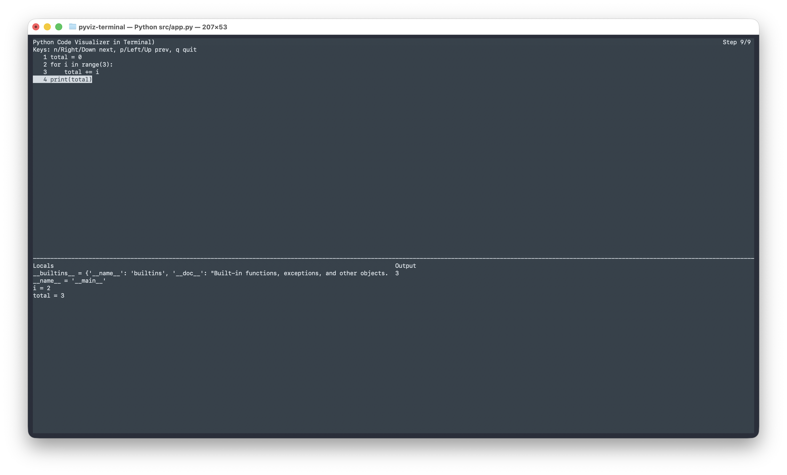

# pyviz-terminal
Visualize Python variables in your terminal as you step through execution.

## What it does
- Runs your Python code under a tracer
- Shows the current line, local variables, and stdout/stderr output
- Lets you step forward/backward through execution in a curses UI

## Requirements
- Python 3.8+
- A terminal that supports curses

## Quick start
```bash
python src/app.py
```
Paste Python code, then finish with a line containing only `END`.

## Screenshot


Example input:
```python
total = 0
for i in range(3):
    total += i
print(total)
END
```

## Controls
- `n` / Right / Down: next step
- `p` / Left / Up: previous step
- `q`: quit

## Notes
- Execution is limited to 1000 traced steps.
- Only lines from your pasted code are traced.
